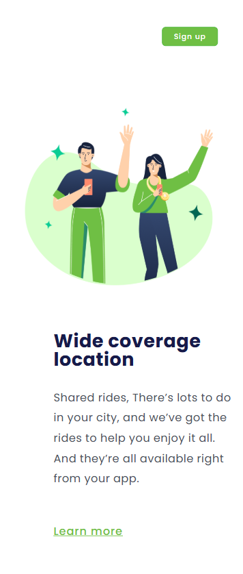

# 🚗 Wide Coverage Location - Desafio 01

> Um projeto web responsivo sobre serviços de transporte compartilhado

## 📋 Sobre o Projeto

Este é um projeto de página web que apresenta um serviço de localização com ampla cobertura, focado em caronas compartilhadas. A página possui um design clean e responsivo.

## 🖼️ Preview do Projeto

### 🖥️ Versão Desktop


*Layout completo da página em tela grande, mostrando o header com navegação e a seção principal com imagem e conteúdo lado a lado.*

### 📱 Versão Mobile


*Layout responsivo adaptado para dispositivos móveis, com elementos empilhados verticalmente para melhor experiência de navegação.*

## 🛠️ Tecnologias Utilizadas

- **HTML5** - Estrutura da página
- **CSS3** - Estilização e responsividade
- **Design Responsivo** - Adaptável a diferentes dispositivos

## 📁 Estrutura do Projeto

```
Desafio 01/
├── index.html
├── Screenshot_1.png
├── Screenshot_2.png
├── src/
│   ├── css/
│   │   ├── style.css
│   │   └── responsivo.css
│   └── image/
│       └── Congratulation.png
```

## 🎨 Funcionalidades

- ✅ Header com navegação (Products, Company, Blog, Log in)
- ✅ Botão de cadastro (Sign up)
- ✅ Seção principal com imagem ilustrativa
- ✅ Conteúdo sobre serviços de transporte
- ✅ Design responsivo para mobile e desktop
- ✅ Layout adaptativo que reorganiza elementos conforme o tamanho da tela

## 🚀 Como Executar

1. Clone o repositório
2. Abra o arquivo `index.html` no seu navegador
3. Pronto! 🎉

## 📱 Responsividade

O projeto conta com CSS específico para responsividade, garantindo uma boa experiência em:
- 📱 Dispositivos móveis - Layout vertical otimizado
- 💻 Tablets - Adaptação intermediária
- 🖥️ Desktops - Layout horizontal completo

Como pode ser visto nos screenshots acima, o design se adapta perfeitamente a diferentes tamanhos de tela, mantendo a usabilidade e estética em todos os dispositivos.

## 🎯 Objetivo do Desafio

Desenvolver uma landing page responsiva e atrativa para um serviço de transporte, aplicando boas práticas de HTML e CSS, com foco especial na responsividade e experiência do usuário.

## 👨‍💻 Autor

**José Alberto**
- GitHub: [@josealbertodeev](https://github.com/josealbertodeev)

---

## Acesse o site do projeto aqui: 👉 [Link](https://landing-page-responsivo-kzqtjoaqj.vercel.app)

⭐ Se gostou do projeto, deixe uma estrela!
